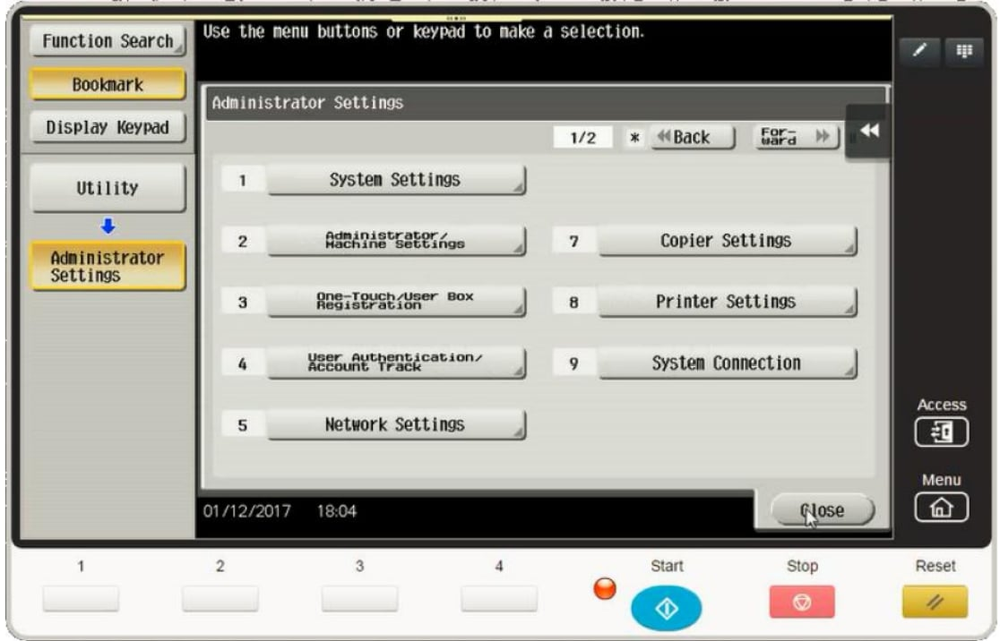
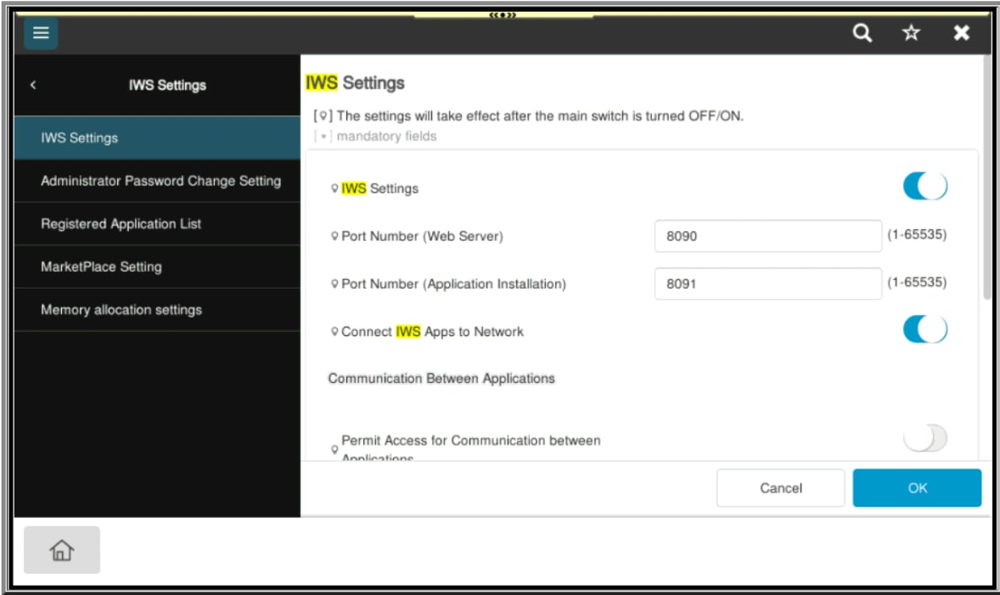
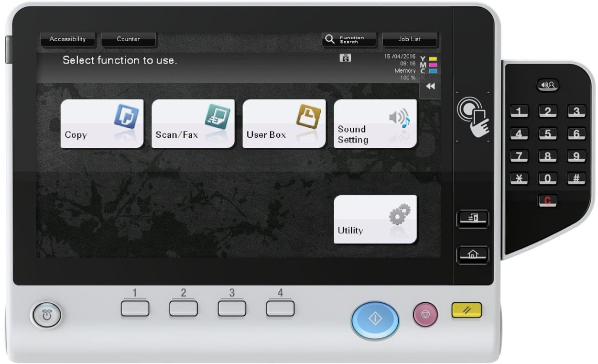
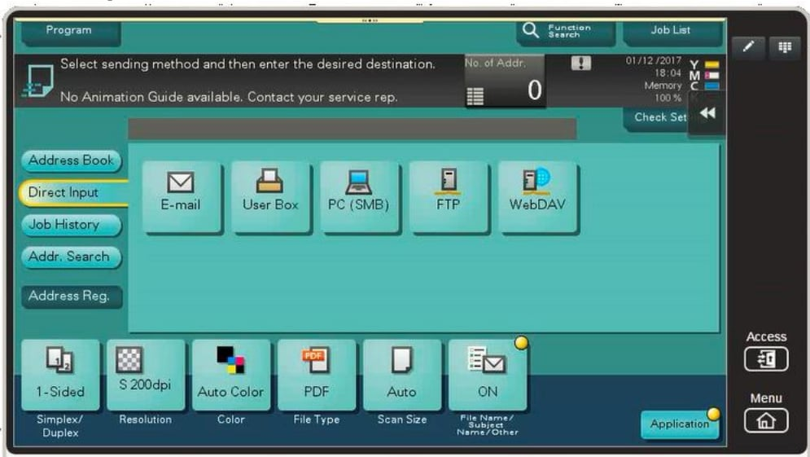
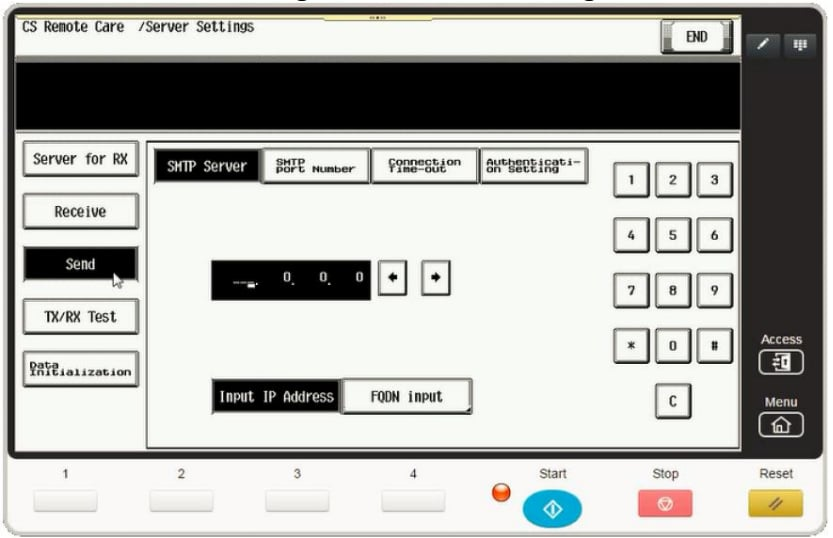

# Printer Software Project

This project provides a high-level overview of the software system for a multifunction printer (MFP).  
The content here is intended as a summary for presentation purposes.

---

## 📑 Table of Contents
1. [Project Architecture](#-project-architecture)  
   - [C (Firmware Layer)](#c-firmware-layer)  
   - [C# (Driver Layer)](#c-driver-layer)  
   - [C++ with Qt + Backend](#c-with-qt--backend)  
   - [JavaScript (Web Admin)](#javascript-web-admin)  
   - [Python & Node.js (Supporting Tools)](#python--nodejs-supporting-tools)  
2. [UI Screenshots](#-ui-screenshots)  
   - [Administrator Settings](#1-administrator-settings)  
   - [IWS Settings (Web Admin Panel)](#2-iws-settings-web-admin-panel)  
   - [Main Function Screen](#3-main-function-screen)  
   - [Scan/Send Menu](#4-scansend-menu)  
   - [Service Mode – Server Settings](#5-service-mode--server-settings)  
3. [Skills and Technologies](#-skills-and-technologies)  
4. [Confidentiality Note](#-confidentiality-note)  

---

## 🏗️ Project Architecture

### C (Firmware Layer)
- Runs directly on the printer’s control board.  
- Manages low-level drivers: motor, printhead, scanner, paper sensors, Ethernet/WiFi.  
- Communicates with control chips via SPI/I²C/UART.  
- Provides basic APIs for the upper backend layer (C++).  
- Also used to **define and handle network protocols**: TCP/IP, SMTP (email), FTP, SMB, IPP (network printing), SNMP (device monitoring).

### C# (Driver Layer)
- Builds printer drivers for Windows/Linux/Mac.  
- Manages standard communication (IPP, LPR, SMB, USB).  
- Provides small UI dialogs for selecting paper size, print resolution, print mode.  
- Built on **.NET Framework / .NET Core** for OS integration.

### C++ with Qt + Backend
- Qt: builds the touchscreen UI on the printer device.  
- C++ backend: handles system logic such as user management, job queue, authentication, scan-to-email, fax.  
- Integrates network protocols at a higher level (via APIs from the C layer).  
- Uses multithreading, memory management, and IPC to manage concurrent tasks.

### JavaScript (Web Admin)
- Builds the **web-based administration panel** for IT admins.  
- Enables system configuration: ports, SMTP, user accounts, marketplace apps.  
- Communicates with the C++ backend through REST APIs.  
- Runs on an **embedded web server** (Nginx/lighttpd) inside the printer.

### Python & Node.js (Supporting Tools)
- **Python**: used for automation scripts, test frameworks, data parsing, log analysis, and maintenance tools.  
- **Node.js**: used for building auxiliary web services, integration testing, and lightweight microservices to extend system capabilities.  
- These supporting languages help accelerate development and provide better tooling for QA, DevOps, and system integration.

---

## 📸 UI Screenshots

### 1. Administrator Settings

Touchscreen UI (Qt + C++).  
Functions: system configuration, administration, user accounts, network, printer, copier...

---

### 2. IWS Settings (Web Admin Panel)

Web-based interface (JavaScript).  
Functions: enable/disable IWS, configure HTTP/HTTPS ports, manage admin password, memory allocation.

---

### 3. Main Function Screen

Main screen on the printer.  
Functions: Copy, Scan/Fax, User Box, Utility, Sound Setting.

---

### 4. Scan/Send Menu

UI for sending scanned documents.  
Supports: Email, SMB, FTP, WebDAV, User Box storage.  
Options: resolution, color mode, file format (PDF, TIFF, JPEG).

---

### 5. Service Mode – Server Settings

UI for maintenance engineers.  
Functions: configure SMTP server, check TX/RX status, reset data.

---

## 🛠️ Skills and Technologies

- **Programming Languages**  
  - C (firmware, hardware drivers, protocol stack)  
  - C# (.NET) – Printer drivers  
  - C++/Qt – Touchscreen UI and backend logic  
  - JavaScript (Vue.js/React/Vanilla JS) – Web admin interface  
  - Python – automation, testing, tools  
  - Node.js – auxiliary services, microservices  

- **Technical Expertise**  
  - Embedded programming (firmware, memory management)  
  - Network protocols (SMTP, FTP, SMB, IPP, SNMP, WebDAV)  
  - Multithreading and concurrency in C++  
  - GUI design with Qt, responsive web UI with JS  
  - Cross-platform driver development  
  - Security: authentication, SSL/TLS, account tracking  

- **Teamwork**  
  - Modules divided by specialization: firmware (C), driver (C#), UI/backend (C++), web UI (JS), supporting tools (Python/Node.js).  
  - Project management using GitLab/JIRA.  
  - CI/CD pipelines for firmware, driver, and UI builds.  

---

## 🔒 Confidentiality Note

This README only provides a **high-level overview** of the project for demonstration and presentation purposes.  
The actual project is **much more complex** and contains details that cannot be shared publicly due to **customer confidentiality policies**.